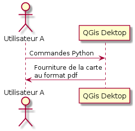

=======================================
But de la démarche
=======================================

Un logiciel :

 - Peut être utilisé via son IHM classique.

 - Parfois, il peut aussi être utilisé via une interface Web.

 - Parfois aussi, il peut être piloté par des commandes qu'un developpeur peut
   alors utiliser dans ses scripts.

Pour comprendre la démo, il faut faire la distinction entre les points 2 et 3.

----

Pourquoi ce choix de ne pas avoir QGis sur le bureau ?
======================================================

L'IHM "classique" : trop lourde ?
---------------------------------

Une interface trop lourde peut-etre, pour
des besoins parfois limités et spécifiques

..  :target: http://geogig.org/docs/start/intro.html
..  :height: 400px
..  :width: 200px

----

Exemple de besoin très simple
-----------------------------

"Je veux un plan du réseau d'éclairage public."

Qui est l'émetteur de cette demande ?

  * Une personne a qui on peut répondre "RTFM !" ou "DIY !"

    - un utilisateur de QGis,
    - un agent X,

  * Une personne dont la réponse est plus difficile à formuler

    - un "chef", un directeur, un élu,...
    - un usager externe à la ville

----

Un plan généré à partir d'un évènement
--------------------------------------

L'idée est donc de ne pas utiliser QGIS de manière classique, c'est à dire,
en ouvrant le logiciel, en faisant des manipulations à l'intérieur,
mais il s'agit ici de piloter QGis depuis l'exterieur, d'agir sur lui,
en ne sachant même pas que c'est QGis qui est utilisé.

On va créer un évènement qui va agir sur Qgis depuis l'extérieur.

----

Une première solution : une interface web
=========================================

Cette interface doit :
 - Permettre la genération d'un plan ou d'un atlas par des non utilisateurs de Qgis
 - Fournir une simple interface pour dessiner une emprise et choisir une mise en page

.. image:: ../_static/QGisEnCoulisse_03.png
  :align: center
  :scale: 100%

----

**Démo**

----

Autres utilisations possibles
=============================

Une interaction "Homme-Machine" ... ou pas
------------------------------------------

Via un formulaire web, c'est l'usager qui déclenche la génération du plan,
mais il est possible d'imaginer d'autres déclencheurs.

  * Exemples de déclencheurs :

    - Creation d'un plan à partir d'un fichier xml reçu par mail (DICT)
    - Actualisation d'un plan (emprise immuable)
      déclenchement selon une date (pas d'interface Homme-Machine)
    - Actualisation d'une carte thematique
      déclenchement via un trigger dans une base de données

----

Des données en entrée
---------------------

Dans la démo, c'est l'usager qui dessine l'emprise du plan à générer,
mais il est possible de transmettre d'autres informations

  * Autres informations pouvant être données en entrée

    - Jointure avec un fichier excel conteant des données attributaires
      génération d'une carte thématique
    - Des documents à attacher aux objets créés

----
