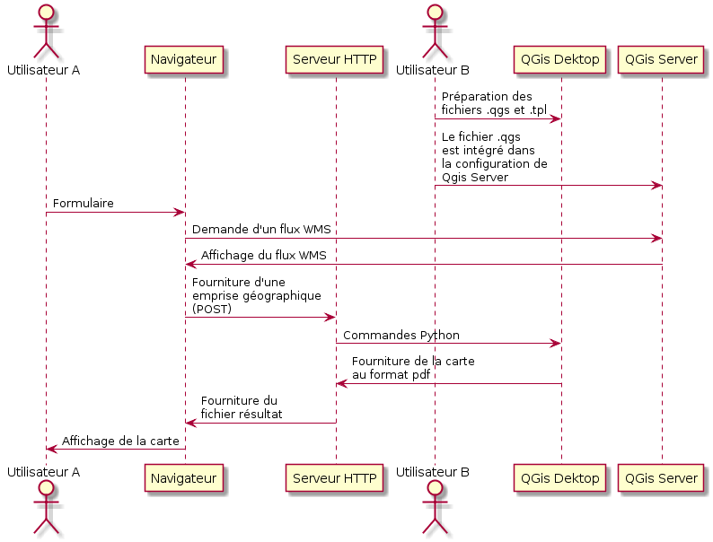

===================================
Brique complémentaire : QGis server
===================================

----

Ajout facultatif de QGis Server
===============================

Dans cette démo, QGis Server a aussi été utilisé.

Il n'est pas utilisé pour générer le plan pdf (uniquement le script python)

Par contre il est utilisé pour générer le flux WMS affiché dans le navigateur
du client via openlayers.

----

Les avantages par rapport a un autre serveur WMS
================================================

Par rapport à Mapserver par exemple, avec QGis Server, il n'y a pas besoin
d'exporter les styles dans un mapfile.

Le projet est configuré une seule fois.

----
