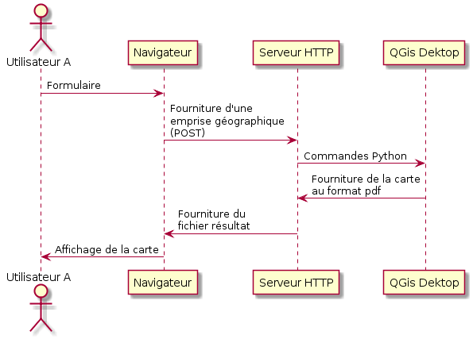

********************************************************
Partie 2 : Quand l'IHM de QGis devient une interface web
********************************************************

----

.. include:: QGisEnCoulisse_chapter_02_03_hov.rst

.. .. .. include:: source/geogig/chapter03_hov.rst

.. include:: QGisEnCoulisse_chapter_02_04_hov.rst
