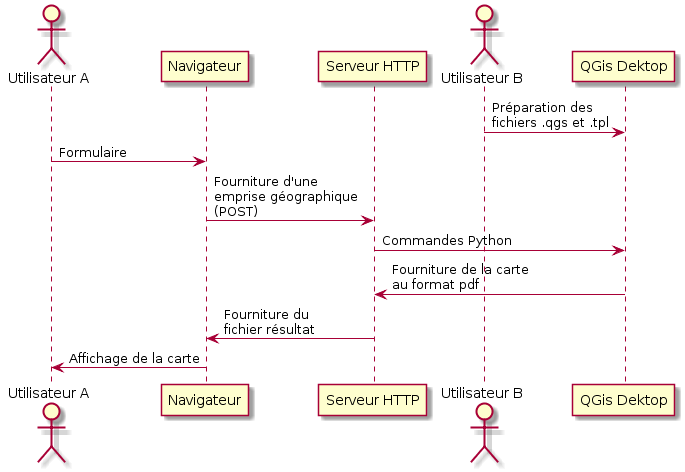

***************************************************
Partie 3 : QGis est relegué en tant que back office
***************************************************

----

Une application de back office est la partie d'un système informatique qui
n'est pas accessible aux utilisateurs finaux ou aux clients,
par opposition à une application de front office.

Une traduction possible de back-office est arrière-boutique, service d'appui,
ou encore arrière-guichet.

----

.. include:: QGisEnCoulisse_chapter_03_05_hov.rst

.. .. include:: source/geogig/chapter05_hov.rst

.. include:: QGisEnCoulisse_chapter_03_06_hov.rst

.. .. include:: geogig/chapter06.rst
.. .. include:: source/geogig/chapter06_hov.rst

.. include:: QGisEnCoulisse_chapter_03_07_hov.rst

.. .. include:: geogig/chapter07.rst
